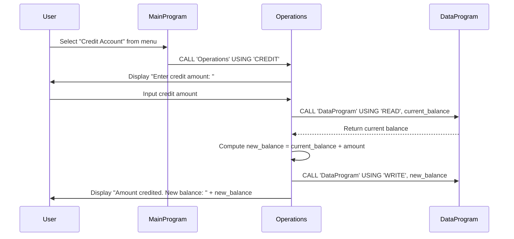

# COBOL Student Account Management System

This project contains a legacy COBOL-based system for managing student accounts. The system allows viewing balances, crediting accounts, and debiting accounts with basic validation.

## COBOL Files Overview

### main.cob
**Purpose:** Serves as the main entry point and user interface for the account management system.

**Key Functions:**
- Displays a menu with options: View Balance, Credit Account, Debit Account, Exit
- Accepts user input for menu selection
- Calls the Operations program based on user choice
- Loops until the user chooses to exit

### operations.cob
**Purpose:** Handles the core business logic for account operations, including crediting, debiting, and balance inquiries.

**Key Functions:**
- Processes different operation types (TOTAL, CREDIT, DEBIT)
- For CREDIT: Prompts for amount, adds to balance, updates storage
- For DEBIT: Prompts for amount, checks sufficient funds, subtracts if valid, updates storage
- For TOTAL: Retrieves and displays current balance
- Interacts with DataProgram for balance storage operations

### data.cob
**Purpose:** Manages persistent storage of the account balance.

**Key Functions:**
- Stores the balance in working storage (initially $1000.00)
- Supports READ operation: Returns current balance
- Supports WRITE operation: Updates stored balance
- Acts as a simple data layer for balance persistence

## Business Rules

### Student Account Rules
- **Initial Balance:** Accounts start with a default balance of $1000.00
- **Debit Validation:** Debits are only allowed if the account has sufficient funds. If the debit amount exceeds the current balance, the transaction is rejected with an "Insufficient funds" message.
- **Balance Updates:** All balance changes (credits and valid debits) are immediately persisted.
- **No Overdraft:** The system does not allow negative balances.

## System Architecture
The system follows a modular design:
- Main program handles user interaction
- Operations program contains business logic
- Data program manages data persistence

All programs communicate via CALL statements and linkage sections, typical of COBOL subroutine architecture.

## Sequence Diagram

The following sequence diagram illustrates the data flow for a credit operation in the student account management system:

For debit operations, the flow is similar but includes a validation step to check if the balance is sufficient before proceeding with the subtraction. For balance inquiries (view balance), only the read operation occurs without any write back.